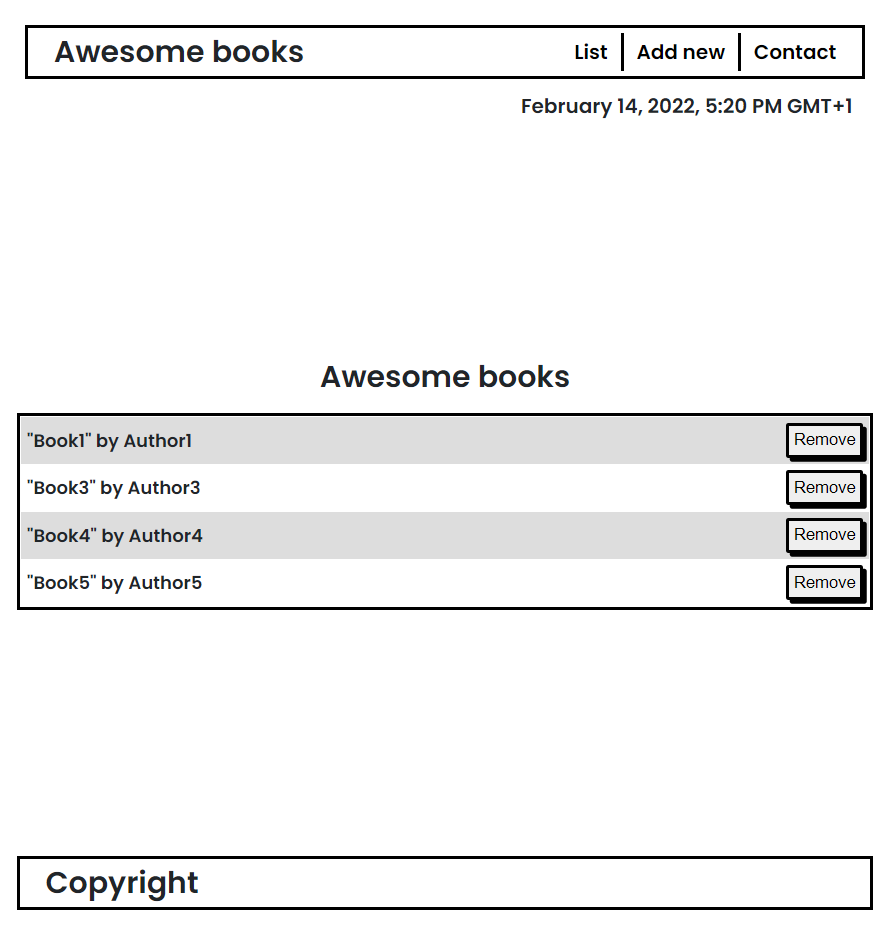

# Awesome books

An implementation of a library website, with 3 sections: 

- List, where you can check your books list.
- Add, where you can add a new book.
- Contact, where you can check the contact information.

## Live Demo

[Live Demo Link](https://mirouhml.github.io/Awesome-Books-ES6/)

## Built With

- HTML
- CSS
- JavaScript
- linters
- VSCode

## Author

👤 **Mirouhml**

- GitHub: [@mirouhml](https://github.com/mirouhml)
- LinkedIn: [LinkedIn](https://www.linkedin.com/in/ammar-hamlaoui-514909189/)
- Twitter: [@kuronomirou](https://twitter.com/kuronomirou)

## 🤝 Contributing

Contributions, issues, and feature requests are welcome!

Feel free to check the [issues page](../../issues/).

## Show your support

Give a ⭐️ if you like this project!

## 📝 License

This project is [MIT](./MIT.md) licensed.
